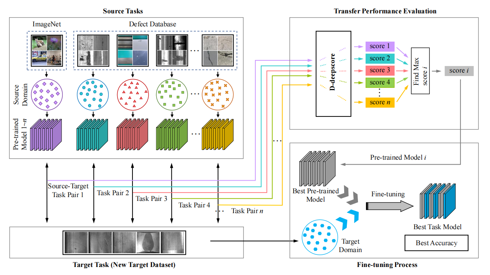
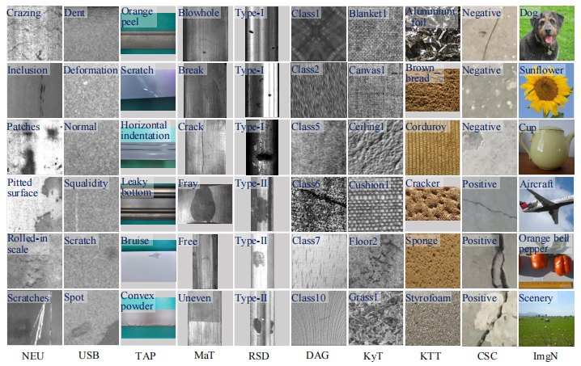

# D-deepscore
An Evaluation Method for Model Transfer Learning Performance in Industrial Surface Defect Detection Tasks
# Fusion-of-multi-light-source-illuminated-images-for-defect-inspection

By  Guizhong Fu, Zengguang Zhang.

Cite us using:

Guizhong Fu*, Zengguang Zhang, Li J, et al. An Evaluation Method for Model Transfer Learning Performance in Industrial
Surface Defect Detection Tasks[J]. Expert Systems with Applications, 2025: 128680.

The paper is available at  |[`[PDF Download]`](https://www.sciencedirect.com/science/article/pii/S0957417425022985)

### Introduction
In this paper, we proposed the D-deepscore, which could quickly and accurately evaluate models from different source domains on a target domain, and then select the source domain model without any
fine-tuning process.

To validate the accuracy of D-deepscore in evaluating the transfer performance of pre-trained models, we tested D-deepscore on various image datasets and analyzed the evaluation scores against the accuracy of the models after training. The results showed a high degree of consistency between the evaluation curves and the model accuracy. 

### Pre-traind model and transfer feature file download
Google Drive: https://drive.google.com/file/d/1-nzyftwh1guvUbbKHsNj1OZRhFBMe_kk/view?usp=sharing

Baidu Cloud: https://pan.baidu.com/s/1cFSsh3A5xGmBTTQxpKEIHQ?pwd=qrad Password：qrad

### Experimental Steps
### Step 1: Obtaining the pre-trained model
There are two ways to obtain pre-trained models. One is to pre-train the selected model using your own dataset, and the other is to obtain the official pre-trained model.
### Step 2: Extraction of transfer features
We extract the feature information from the conv4_x layer of the ResNet18 pre-trained model as representation information, and then D-deepscore uses the representation information and target data to obtain the evaluation score.
### D-deepscore code  
Run transfer_feature.py to obtain the representation information of the pre-trained model.  
Run D-deepscore to obtain evaluation scores and rankings for multiple pre-trained models.

### Contact
If you have any questions, feel free to contact:
- Guizhong Fu (fuguizhongchina@163.com)
